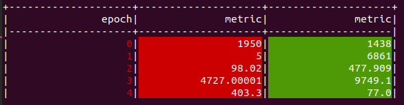
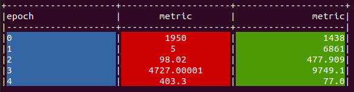

# PyLogger

A simple utility to help tidy up your logging.

## Usage

```python
from pylogger import PyLogger
logger = PyLogger.PyLogger()
"""
args:
    columns - column names in list default:None 
    border - display border (True/False) default:True 
    col_widths - widths of each column (dict) eg: {0:10, 1:15, 2:25} default:None
    bg_colors - background color of each column (dict) default:"default"
    fg_colors - text color of each column (dict) default:"default"
    justify - text justification of each column choose from "l"-left, "c"-centre, "r"-right (dict) default:"r"
    def_col_width - width of all columns (int) default:20
"""
for epoch in num_epochs:
    out = model(inp)
    ...
    ...
    ...
    logger(a, b, c, d, e, f, ......)

```

**Examples**

```python
from pylogger import PyLogger
a = [1950,5,98.02,4727.00001,403.3]
b = [1438,6861,477.909,9749.1,77.00]
logger = PyLogger.PyLogger()
for i in range(5):
    logger("epoch - {}".format(i), "metric - {}".format(a[i]), "metric - {}".format(b[i]))
```

```bash
+--------------------+--------------------+--------------------+
|epoch - 0           |metric - 1950       |metric - 1438       |
|epoch - 1           |metric - 5          |metric - 6861       |
|epoch - 2           |metric - 98.02      |metric - 477.909    |
|epoch - 3           |metric - 4727.00001 |metric - 9749.1     |
|epoch - 4           |metric - 403.3      |metric - 77.0       |
```

**With headings**

```python
logger = PyLogger.PyLogger(columns=["epoch", "metric", "metric"])
for i in range(5):
    logger(i, a[i], b[i])
```

```bash
+--------------------+--------------------+--------------------+
|               epoch|              metric|              metric|
|--------------------+--------------------+--------------------|
|                   0|                1950|                1438|
|                   1|                   5|                6861|
|                   2|               98.02|             477.909|
|                   3|          4727.00001|              9749.1|
|                   4|               403.3|                77.0|
```

**With color**

```python
logger = PyLogger.PyLogger(columns=["epoch", "metric", "metric"], fg_colors={0:"red"}, bg_colors={1:"red",2:"green"})
```



**Change justification**

```python
logger = PyLogger.PyLogger(columns=["epoch", "metric", "metric"], bg_colors={0:"blue",1:"red",2:"green"}, justify={0:"l",1:"c"})
```




